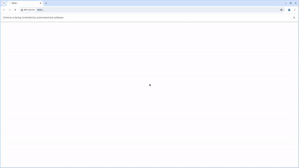

  <a href="https://magento.softwaretestingboard.com/" rel="nofollow">
  <themed-picture data-catalyst-inline="true" data-catalyst=""><picture>

    </picture></themed-picture>
  </a>

<h2 align="center"> Demo auto-tests LUMA store </h2>
<h3 align="center"> Используемые инструменты в проекте </h3>

    
    
    
    
    
    
    
    
    
    
    

    
<h2> Структура 
каталогов проекта</h2>

      <ul>
        <li><code>pages:</code> Модули (классы страниц сайта и их методы)</li>
        <li><code>resources:</code> Ресурсы (иконки, скриншоты, gif)</li>
        <li><code>tests:</code> Тесты</li>
        <li><code>user:</code> Несколько типов юзеров для тестов</li>
        <li><code>utils:</code> Вспомогательные функции для работы с вложенями</li>
        <li><code>pytest.ini</code> Файл настроек и параметров тестирования</li>
        <li><code>requirements.txt</code> Файл с требованиями к проекту</li>
      </ul>

    
<h2> Список 
тестов</h2>

      <ul>
        <li>1) Переход по ссылкам методом <code>click()</code></li>
        <li>2) Переход по ссылкам методом <code>hover()</code></li>
        <li>3) Создание аккаунта</li>
        <li>4) Ввод логина (успешный и неуспешный)</li>
        <li>5) Работа с корзиной (добавить товар, исправить, удалить)</li>
      </ul>

<h2>  Запуск тестов и получение 
отчета</h2>
<h3>Локально </h3>

    
 1) Склонировать репозиторий

      <ul>
        <li><code>git clone https://github.com/Mksm3000/hw_qa_guru_14_resume.git</code></li>
      </ul>

    
 2) Установить зависимости и запустить тесты

      <ul>
        <li><code>python -m venv .venv</code></li>
        <li><code>source .venv/bin/activate</code></li>
        <li><code>pip install -r requirements.txt</code></li>
        <li><code>pytest .</code></li>
      </ul>

    
 3) Получить отчёт о прохождении тестов в allure

      <ul>
        <li><code>allure serve allure-results/</code></li>
      </ul>

    
 После выполнения команды откроется браузер с отчетом

      

<h3>Удалённо </h3>

    
 1) Необходимо открыть проект на Jenkins 

        <ol>
            <a href="https://jenkins.autotests.cloud/job/C13-ShamelessMax-14_Resume/">C13-ShamelessMax-14_Resume</a>
        </ol>

    
 2) Для выполнения тестов нажать на <code>Build Now</code>

      

    
 3) По окончанию тестов для просмотра результатов нажать на иконку 
<code>Allure Report</code>

      

<h3>Дополнительно</h3>

    
 Уведомление о выполнении тестов может быть отправлено через Telegram 

        

    
Процесс выполнения теста может быть сохранён в формате видео

        

